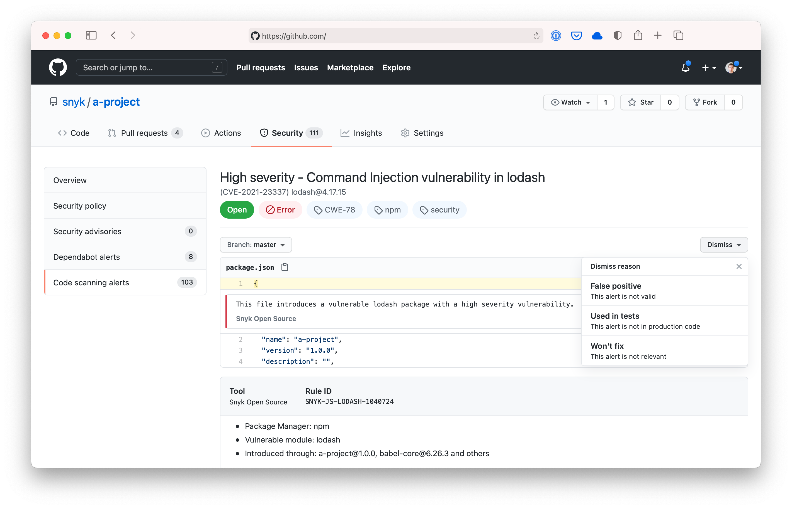

# Vulnmap Ruby Action

A [GitHub Action](https://github.com/features/actions) for using [Vulnmap](https://khulnasoft.com/VulnmapGH) to check for
vulnerabilities in your Ruby projects. This Action is based on the [Vulnmap CLI][cli-gh] and you can use [all of its options and capabilities][cli-ref] with the `args`.


You can use the Action as follows:

```yaml
name: Example workflow for Ruby using Vulnmap
on: push
jobs:
  security:
    runs-on: ubuntu-latest
    steps:
      - uses: actions/checkout@master
      - name: Run Vulnmap to check for vulnerabilities
        uses: khulnasoft-lab/vulnmap-actions/ruby@master
        env:
          VULNMAP_TOKEN: ${{ secrets.VULNMAP_TOKEN }}
```

## Properties

The Vulnmap Ruby Action has properties which are passed to the underlying image. These are passed to the action using `with`.

| Property | Default | Description                                                                                         |
| -------- | ------- | --------------------------------------------------------------------------------------------------- |
| args     |         | Override the default arguments to the Vulnmap image. See [Vulnmap CLI reference for all options][cli-ref] |
| command  | test    | Specify which command to run, for instance test or monitor                                          |
| json     | false   | In addition to the stdout, save the results as vulnmap.json                                            |

For example, you can choose to only report on high severity vulnerabilities.

```yaml
name: Example workflow for Ruby using Vulnmap
on: push
jobs:
  security:
    runs-on: ubuntu-latest
    steps:
      - uses: actions/checkout@master
      - name: Run Vulnmap to check for vulnerabilities
        uses: khulnasoft-lab/vulnmap-actions/ruby@master
        env:
          VULNMAP_TOKEN: ${{ secrets.VULNMAP_TOKEN }}
        with:
          args: --severity-threshold=high
```

## Uploading Vulnmap scan results to GitHub Code Scanning

Using `--sarif-file-output` [Vulnmap CLI flag][cli-ref] and the [official GitHub SARIF upload action](https://docs.github.com/en/code-security/secure-coding/uploading-a-sarif-file-to-github), you can upload Vulnmap scan results to the GitHub Code Scanning.



The Vulnmap Action will fail when vulnerabilities are found. This would prevent the SARIF upload action from running, so we need to introduce a [continue-on-error](https://docs.github.com/en/actions/reference/workflow-syntax-for-github-actions#jobsjob_idstepscontinue-on-error) option like this:

```yaml
name: Example workflow for Ruby using Vulnmap
on: push
jobs:
  security:
    runs-on: ubuntu-latest
    steps:
      - uses: actions/checkout@master
      - name: Run Vulnmap to check for vulnerabilities
        uses: khulnasoft-lab/vulnmap-actions/ruby@master
        continue-on-error: true # To make sure that SARIF upload gets called
        env:
          VULNMAP_TOKEN: ${{ secrets.VULNMAP_TOKEN }}
        with:
          args: --sarif-file-output=vulnmap.sarif
      - name: Upload result to GitHub Code Scanning
        uses: github/codeql-action/upload-sarif@v2
        with:
          sarif_file: vulnmap.sarif
```

Made with 💜 by KhulnaSoft DevSec

[cli-gh]: https://github.com/khulnasoft-lab/vulnmap 'Vulnmap CLI'
[cli-ref]: https://docs.khulnasoft.com/vulnmap-cli/cli-reference 'Vulnmap CLI Reference documentation'
